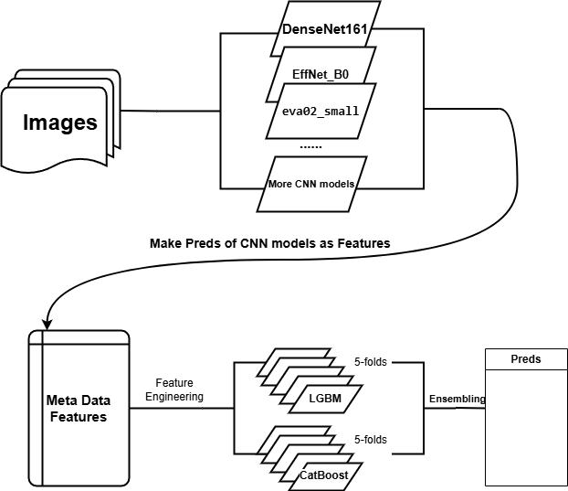

# [ISIC 2024 - Skin Cancer Detection with 3D-TBP](https://www.kaggle.com/competitions/isic-2024-challenge)
## Overview
In this competition, you'll develop image-based algorithms to identify histologically confirmed skin cancer cases with single-lesion crops from 3D total body photos (TBP). The image quality resembles close-up smartphone photos, which are regularly submitted for telehealth purposes. Your binary classification algorithm could be used in settings without access to specialized care and improve triage for early skin cancer detection.

## Description
Skin cancer can be deadly if not caught early, but many populations lack specialized dermatologic care. Over the past several years, dermoscopy-based AI algorithms have been shown to benefit clinicians in diagnosing melanoma, basal cell, and squamous cell carcinoma. However, determining which individuals should see a clinician in the first place has great potential impact. Triaging applications have a significant potential to benefit underserved populations and improve early skin cancer detection, the key factor in long-term patient outcomes.

Dermatoscope images reveal morphologic features not visible to the naked eye, but these images are typically only captured in dermatology clinics. Algorithms that benefit people in primary care or non-clinical settings must be adept to evaluating lower quality images. This competition leverages 3D TBP to present a novel dataset of every single lesion from thousands of patients across three continents with images resembling cell phone photos.

This competition challenges you to develop AI algorithms that differentiate histologically-confirmed malignant skin lesions from benign lesions on a patient. Your work will help to improve early diagnosis and disease prognosis by extending the benefits of automated skin cancer detection to a broader population and settings.

## Data
### Dataset Description
What should I expect the data format to be?
The dataset consists of diagnostically labelled images with additional metadata. The images are JPEGs. The associated .csv file contains a binary diagnostic label (target), potential input variables (e.g. age_approx, sex, anatom_site_general, etc.), and additional attributes (e.g. image source and precise diagnosis).

### What am I predicting?
In this challenge you are differentiating benign from malignant cases. For each image (isic_id) you are assigning the probability (target) ranging [0, 1] that the case is malignant.

**The SLICE-3D dataset - skin lesion image crops extracted from 3D TBP for skin cancer detection**
To mimic non-dermoscopic images, this competition uses standardized cropped lesion-images of lesions from 3D Total Body Photography (TBP). Vectra WB360, a 3D TBP product from Canfield Scientific, captures the complete visible cutaneous surface area in one macro-quality resolution tomographic image. An AI-based software then identifies individual lesions on a given 3D capture. This allows for the image capture and identification of all lesions on a patient, which are exported as individual 15x15 mm field-of-view cropped photos. The dataset contains every lesion from a subset of thousands of patients seen between the years 2015 and 2024 across nine institutions and three continents.

The following are examples from the training set. 'Strongly-labelled tiles' are those whose labels were derived through histopathology assessment. 'Weak-labelled tiles' are those who were not biopsied and were considered 'benign' by a doctor.

### Files
**train-image/** - image files for the training set (provided for train only)
**train-image.hdf5** - training image data contained in a single hdf5 file, with the isic_id as key
**train-metadata.csv** - metadata for the training set
**test-image.hdf5** - test image data contained in a single hdf5 file, with the isic_id as key. This contains 3 test examples to ensure your inference pipeline works correctly. When the submitted notebook is rerun, this file is swapped with the full hidden test set, which contains approximately 500k images.
**test-metadata.csv** - metadata for the test subset
**sample_submission.csv** - a sample submission file in the correct format

# Model

## Directory Structure
- Root/
  - Kaggle/
    - Input/
        - model inference script (make preds for test data)
        - preds of training data for CNN models
        - CNN model weights
    - Working/
        - submission files of CNN models(csv)
        - submission.csv
  - isic-tabular-ensemble-lgbm-catboost.ipynb

## Solution

    
    
<em>Solution Diagram</em>

Since the competition has both images and regular meta data, I split the solution process into two parts: training CNN models to process images, adding preds of image from CNN models as extra features and training regular ML model with meta data.

The original notebook author prepared EfficientNet_b0 model and eva02_small models and trained weights. I've tested other models in EfficientNet series but they don't make distinguishable performance due to limit size of positive cases. I've made effort on expand training size by adding extra positive cases from past competitions, but some models even perform worse. Therefore, I trained new DenseNet161 model with all positive cases from this competition with same amount of negative cases. Then test data inference script is written and preds of training data are produced.

The final preds are made by 5-folds of LGBM model and 5-folds of CatBoost model ensembled with given weights. Due to the lesson I learned from previous competitions, I won't stick too much on tuning ensembling weights this time.

The training and inference time for ML model is about 1000 seconds. The approximate inference time for test data is about 4 hours in total and the limitation of this competition is <= 9 hours, which means that there is spare inference time that I could add one or two extra CNN preds as new features.