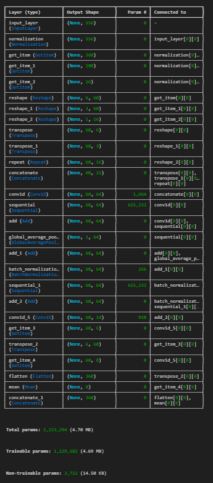

# [Competition](https://www.kaggle.com/competitions/leap-atmospheric-physics-ai-climsim)
## Overview
In this competition, you’ll develop machine learning models that accurately emulate subgrid-scale atmospheric physics in an operational climate model—an important step in improving climate projections and reducing uncertainty surrounding future climate trends.

## Description
Climate models are essential to understanding Earth’s climate system. Because of the complexity of Earth’s climate, these models rely on parameterizations to approximate the effects of physical processes that occur at scales smaller than the size of their grid cells. These approximations are imperfect, however, and their imperfections are a leading source of uncertainty in expected warming, changing precipitation patterns, and the frequency and severity of extreme events. The Multi-scale Modeling Framework (MMF) approach, by contrast, more explicitly represents these subgrid processes, but at a cost too high to be used for operational climate prediction.

Your task is to develop ML models that emulate subgrid atmospheric processes–such as storms, clouds, turbulence, rainfall, and radiation–within E3SM-MMF, a multi-scale climate model backed by the U.S. Department of Energy. Because ML emulators are significantly cheaper to inference than MMF, progress on this front can help scientists realize a future in which high-resolution and physically credible long-term climate projections are broadly accessible, bringing greater clarity to the hazards associated with climate change and empowering policymakers with the knowledge necessary to mitigate them.

This competition accompanies an upcoming 2024 ICML Machine Learning for Earth System Modeling (ML4ESM) Workshop and is based on the ClimSim paper and dataset which won the Outstanding Datasets and Benchmarks Paper award at NeurIPS 2023. Winning submissions will be highlighted at the upcoming ML4ESM ICML workshop, and participants in this Kaggle competition are also encouraged to submit workshop papers. The workshop itself will have its own best paper award and an accompanying cash prize of $3,000.

# [Data](https://www.kaggle.com/competitions/leap-atmospheric-physics-ai-climsim/data)
The dataset (both training and test) for this competition is generated by the (E3SM-MMF) climate model. The multi-scale nature of E3SM-MMF allows it to explicitly resolve the effects of small-scale processes such as clouds and storms on large-scale climate patterns. However, this multi-scale framework comes at a great computational cost, limiting its usage for experiments and ensemble climate projections. The goal is to train a model to emulate the effects of these small-scale processes at a fraction of the cost of explicitly resolving them.

Every row of the training set corresponds to the inputs and outputs of a cloud-resolving model (CRM) in E3SM-MMF at some location and timestep. There are 556 columns corresponding to 25 input variables and 368 columns corresponding to 14 target variables. Some variables (like air temperature) span an entire atmospheric column and have 60 vertical levels, and other variables (like precipitation) are scalars. For the vertically resolved variables, an "_" followed by a number in the range [0,59] is appended to denote vertical level. Lower numbers denote higher positions in the atmosphere. Your goal is to create a model that predicts the target variables associated with a given set of input variables.

To make this competition more accessible, we make use of a subset of the low-resolution data from ClimSim using the full variable list. While we provide all of the data necessary for the competition on Kaggle, competitors are welcome to use HuggingFace if they'd like access to even more training data. A script for recreating the training data using files downloaded from HuggingFace can be found here. It is worth noting that the models in the ClimSim paper also make use of the low-resolution data but do not use the full-variable list. For the purposes of this competition, you will need the following three files to train your model and submit your predictions:

**train.csv** - the training set
**test.csv** - the NEW test set
**sample_submission.csv** - NEW prediction weightings
**test_old.csv** - the (old) test set
**sample_submission_old.csv** - (old) prediction weightings
Please remember to use the sample_submission.csv file to weight your predictions prior to submission, as the reference solution is weighted the same way.

This weighting can also be calculated without downloading this file. The top 12 levels (0-11 inclusive) for 'ptend_q0001', 'ptend_q0002', 'ptend_q0003', 'ptend_u', and 'ptend_v' can be ignored. These values are zeroed out by the prediction weightings in sample_submission.csv. For more information, please consult the for_kaggle_users.py script in the ClimSim GitHub repo.

Given the size of the data, we recommend downloading one file at a time and converting them to a more manageable format (like parquet or npy). If you have access to a High-Performance Computing (HPC) cluster with sufficient storage availability, you can also download the data directly to your remote cluster using the Kaggle API with the following command:

kaggle competitions download -c ClimSim

If you choose to go down this route, please be sure to follow the instructions listed on the Kaggle API GitHub repo.

EDIT: The test.csv and sample_submission.csv have been updated. Please use these files for all future submissions. Submissions made prior to 6/18/24 will be invalidated, and competitors should be resubmitting with the new data. The previous versions are still available for your reference.

# Model
A CNN model was constructed for training. The model summary is shown here. 

    
    
<em>Model Summary</em>

# Conclusion
My own model gained a public score of 0.67480, and the private score is 0.67398, ranked 309/693 on final leaderboard. This competition provides tremendous data with high precision, which lead to high computation requirement. Even my simple model would run more than 10 hour on GPU, and the modeling is no more continuous due to heavy computation tasks and high cost of testing. However, it is still an interesting of experience of learning deep recurrent neural network, especially Seq2Seq model. The model must belong to the masterpiece of LSTM and GRU, and I'm pretty happy of getting involved. 

Case End - 07/15/2024